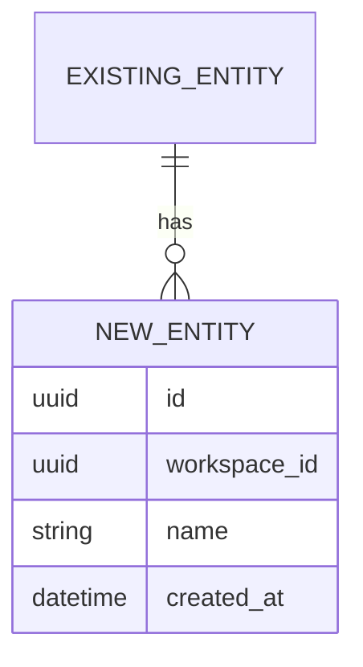
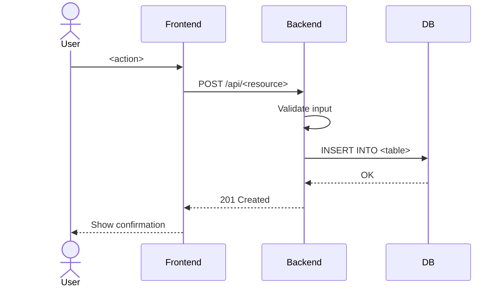
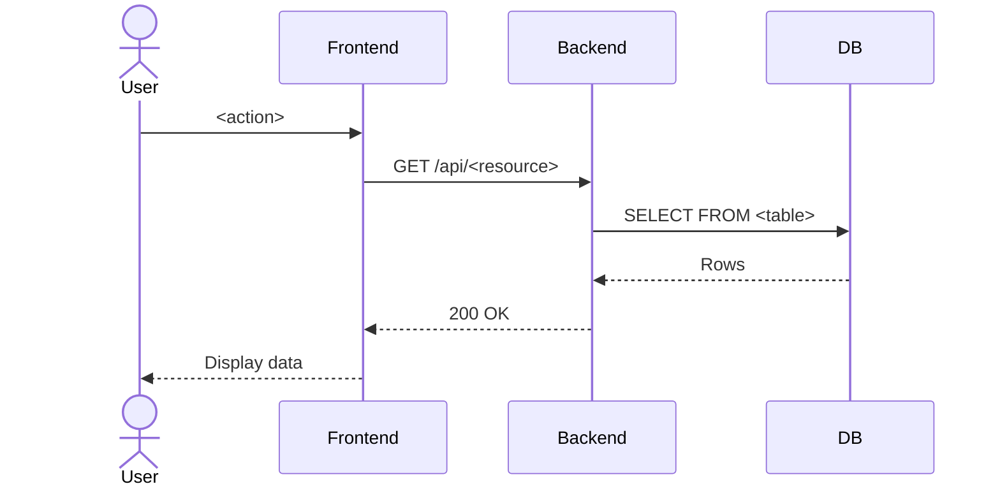

# Tech Spec Template

<!-- Replace all <placeholders> with actual content -->
<!-- Remove this comment block before finalizing -->

# Epic: <Epic Name>

## 1. Context and Objectives

### Problem statement

<What user problem does this solve? Who is affected?>

### Objectives

- <Objective 1>
- <Objective 2>
- <Objective 3>

### Alignment with product vision

<!-- Reference docs/product/vision.md -->
<How does this epic contribute to the product differentiator and core promise?>

### Scope classification

<!-- One of: MVP | Near-term post-MVP | Deferred -->
**Classification**: <scope>

<!-- If this conflicts with docs/product/scope.md, explain the conflict here -->

---

## 2. JTBD (Jobs To Be Done)

<!-- 1-3 JTBD statements -->
1. **When** <situation>, **I want to** <action>, **so I can** <outcome>.
2. **When** <situation>, **I want to** <action>, **so I can** <outcome>.
3. **When** <situation>, **I want to** <action>, **so I can** <outcome>.

---

## 3. Functional Scope

### In scope

| ID | Capability | Description |
|----|-----------|-------------|
| C1 | <name> | <what it does> |
| C2 | <name> | <what it does> |

### Out of scope

| Item | Reason | Future epic candidate |
|------|--------|----------------------|
| <feature> | <why excluded> | <possible future epic> |

---

## 4. User Stories Summary

| ID | Title | Depends on | Priority |
|----|-------|------------|----------|
| US-1 | <title> | none | P1 |
| US-2 | <title> | US-1 | P1 |
| US-3 | <title> | US-1 | P2 |

---

## 5. Data Model Changes

### New entities

<!-- If this epic introduces new tables, describe them here -->



### Modified entities

<!-- If existing tables need new columns or relationships -->

| Table | Change | Migration strategy |
|-------|--------|-------------------|
| `transactions` | Add `split_config` JSON column | Alembic additive migration |
| `accounts` | Add `credit_limit_minor` nullable column | Alembic additive migration |

### Data invariants

- <Invariant 1: e.g., "every new_entity belongs to a workspace">
- <Invariant 2: e.g., "amounts stored in integer minor units">

---

## 6. API Contracts

### Endpoints

<!-- List each endpoint the epic introduces or modifies -->

#### `GET /api/<resource>`

**Purpose**: <what this endpoint does>

**Auth**: Requires workspace membership

**Request**:
```json
{
  "workspace_id": "uuid",
  "filter": "optional"
}
```

**Response** (200):
```json
{
  "items": [...],
  "total": 10
}
```

**Errors**:
- 403: Not a workspace member
- 404: Workspace not found

#### `POST /api/<resource>`

**Purpose**: <what this endpoint does>

**Auth**: Requires workspace membership

**Request**:
```json
{
  "workspace_id": "uuid",
  "name": "string",
  "amount_minor": 1000
}
```

**Response** (201):
```json
{
  "id": "uuid",
  "workspace_id": "uuid",
  "name": "string",
  "amount_minor": 1000,
  "created_at": "2026-01-01T00:00:00Z"
}
```

**Errors**:
- 400: Validation error
- 403: Not a workspace member
- 409: Duplicate or conflict

---

## 7. Runtime Flows

### Flow 1: <Flow name>



### Flow 2: <Flow name>



---

## 8. Non-Functional Requirements

| Requirement | Target | Notes |
|-------------|--------|-------|
| Response time | <200ms for list endpoints | Pagination required |
| Data consistency | ACID for financial operations | No eventual consistency |
| Authorization | Workspace-scoped | Every endpoint checks membership |
| Money precision | Integer minor units | No floating point |

---

## 9. Risks and Open Questions

### Risks

| Risk | Impact | Mitigation |
|------|--------|-----------|
| <risk description> | High/Medium/Low | <mitigation strategy> |

### Open questions

- [ ] <Question 1 — who can answer?>
- [ ] <Question 2 — needs spike?>

---

## 10. ADR Considerations

<!-- List decisions that may need ADRs -->
- <Decision 1>: Is this hard to reverse? → <Yes/No — if yes, recommend ADR>
- <Decision 2>: Does this affect multiple future features? → <Yes/No>

<!-- If ADRs are needed, reference the target path: docs/adr/XXXX-<slug>.md -->

---

## 11. References

- [Product Vision](../product/vision.md)
- [Product Scope](../product/scope.md)
- [Glossary](../product/glossary.md)
- [Data Model](data-model.md)
- [System Overview](system-overview.md)
- [Development Workflow](../process/development-workflow.md)
- Relevant ADRs: <list links>
