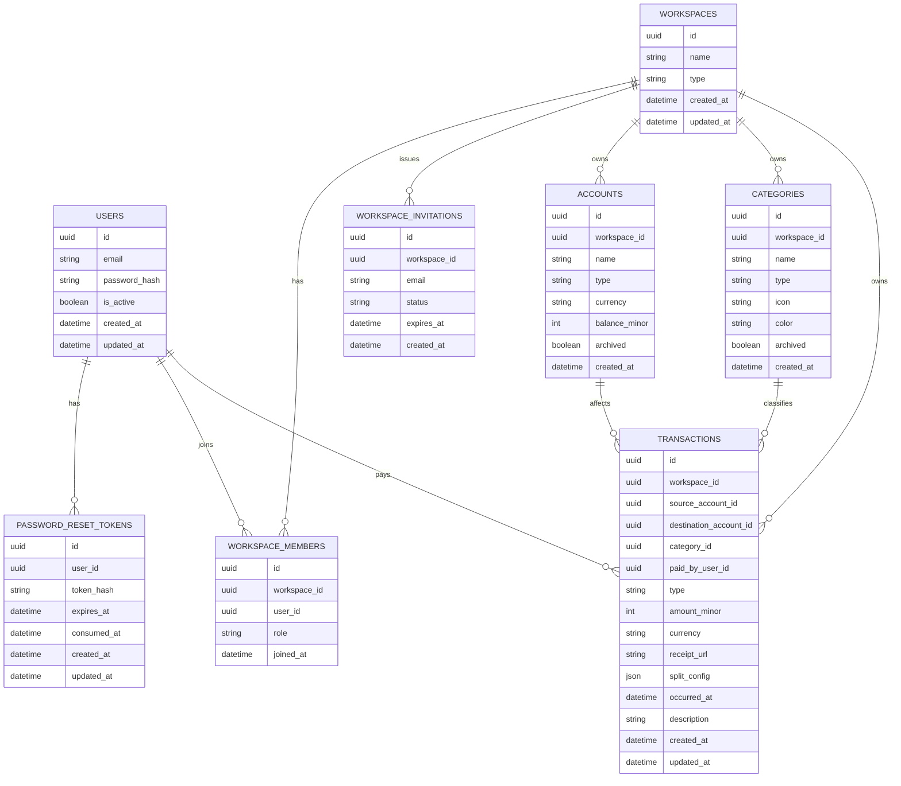

# Data Model

## Data model intent

The initial schema must support:

- secure user access
- password reset and session recovery
- personal and shared workspaces
- workspace membership and permissions
- account-based financial tracking
- categorized transactions
- single receipt linkage for transactions
- future-safe shared-expense splitting

## Core entities

### users

Represents an authenticated person using the system.

Currently implemented fields:

- unique normalized email
- password hash
- `is_active` flag
- audit timestamps

### sessions

Represents authenticated session state managed by the backend.

Current implementation note:

- sessions are stored in Redis, not PostgreSQL
- each session is keyed as `auth:session:<session_id>`
- payload currently contains `user_id` plus creation metadata
- session validity is controlled by TTL and refreshed on authenticated reads

### password_reset_tokens

Represents one-time password reset tokens.

Currently implemented behavior:

- token values are persisted only as hashes
- each token belongs to a user
- tokens expire by timestamp and can be consumed once
- issuing a new reset request revokes previous tokens for that user

### workspaces

Represents the top-level financial context.

Workspace types:

- personal
- shared

### workspace_members

Joins users to workspaces and defines their role.

Initial roles:

- owner
- member

### workspace_invitations

Represents the invitation flow for joining a shared workspace.

### accounts

Represents financial sources and destinations for money movement.

Initial account types:

- cash
- bank account
- savings account
- credit card

### categories

Represents financial classifications for transactions.

Initial category kinds:

- income
- expense

### transactions

Represents financial movements.

Initial movement types:

- income
- expense
- transfer

For shared-expense support, transactions should be able to store:

- payer identity
- nullable `receipt_url`
- split configuration

## Key invariants

- every account belongs to a workspace
- every category belongs to a workspace or seed-derived scope strategy
- every transaction belongs to a workspace
- transaction permissions derive from workspace membership
- transfers must not count as standard income or expense in analytics
- each transaction can link to at most one stored receipt object
- money values are stored in integer minor units
- net balances are derived from split-configured expense transactions, not stored separately
- transfers are excluded from net balance computation

## Initial ER diagram



## Notes on future evolution

## Auth model notes

- the original planned `sessions` table is not part of the current schema; runtime session state is Redis-backed
- PostgreSQL currently persists durable auth entities only through `users` and `password_reset_tokens`
- this matches the implemented backend-owned secure cookie session flow

Likely future schema extensions include:

- credit card limit and cutoff metadata
- richer transaction metadata
- scheduled payments
- budgets
- settlement-specific records or derived net balance views

Those additions should be layered onto the core model rather than forcing a redesign of workspace, accounts, categories, and transactions.

## Implemented category notes

- categories are workspace-scoped records with `name`, `type`, `icon`, `color`, and nullable `archived_at`
- active uniqueness is enforced on `(workspace_id, type, lower(name))`, allowing archived names to be reused later
- workspace creation and migration backfill both use the same default-category seed set so existing and new workspaces converge on the same baseline

## Implemented transaction notes

- transactions are workspace-scoped records stored in a single `transactions` table with explicit `source_account_id` and `destination_account_id`
- `type` is one of `income`, `expense`, or `transfer`, and the allowed account/category combinations are enforced in the backend service layer
- transfers do not use categories and require active source and destination accounts in the same workspace with the same currency
- `paid_by_user_id` is optional but, when present, must reference a workspace member
- `receipt_url` is nullable and stores the backend-served location of a single receipt linked to the transaction
- receipt upload is allowed for income, expense, and transfer transactions
- receipt binaries live in S3-compatible object storage and are streamed back through backend routes
- `split_config` is nullable JSON reserved for shared-expense flows
- `split_config` structure when present:
  ```json
  {
    "type": "equal" | "percentage" | "exact",
    "values": {"<user-uuid>": <int>, ...}
  }
  ```
  - `equal`: values dict is optional; participants split the amount equally
  - `percentage`: each value is 0–100, all must sum to 100
  - `exact`: each value is >0, all must sum to `amount_minor`
  - `paid_by_user_id` must be present when `split_config` is set
  - all user UUIDs in values must reference workspace members
- account `current_balance_minor` is recomputed from transaction history after every transaction create, update, and hard delete

## Net balance computation

Net balances are derived from transaction history, not stored as a separate table.

Computation rules:

- only expense transactions with `split_config` and `paid_by_user_id` contribute to net balances
- each participant in `split_config.values` owes the payer their computed share
- bilateral debts are netted: if A owes B 5000 and B owes A 3000, the net result is A owes B 2000
- transfers are excluded from net balance computation
- net balances are per-currency; no cross-currency netting is performed
- the net balance endpoint accepts an optional `user_id` filter to return only entries involving a specific user

Share computation by split type:

- **equal**: amount divided equally among all participants in values, with remainder distributed to first participants
- **percentage**: `amount_minor * percentage / 100` for each participant
- **exact**: the value assigned to each participant is used directly
