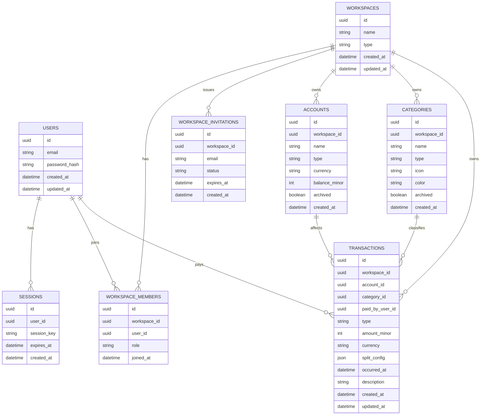

# Data Model

## Data model intent

The initial schema must support:

- secure user access
- personal and shared workspaces
- workspace membership and permissions
- account-based financial tracking
- categorized transactions
- future-safe shared-expense splitting

## Core entities

### users

Represents an authenticated person using the system.

### sessions

Represents authenticated session state managed by the backend.

### workspaces

Represents the top-level financial context.

Workspace types:

- personal
- shared

### workspace_members

Joins users to workspaces and defines their role.

Initial roles:

- owner
- member

### workspace_invitations

Represents the invitation flow for joining a shared workspace.

### accounts

Represents financial sources and destinations for money movement.

Initial account types:

- cash
- bank account
- savings account
- credit card

### categories

Represents financial classifications for transactions.

Initial category kinds:

- income
- expense

### transactions

Represents financial movements.

Initial movement types:

- income
- expense
- transfer

For shared-expense support, transactions should be able to store:

- payer identity
- split configuration

## Key invariants

- every account belongs to a workspace
- every category belongs to a workspace or seed-derived scope strategy
- every transaction belongs to a workspace
- transaction permissions derive from workspace membership
- transfers must not count as standard income or expense in analytics
- money values are stored in integer minor units

## Initial ER diagram

## Notes on future evolution

Likely future schema extensions include:

- credit card limit and cutoff metadata
- receipts and attachments
- richer transaction metadata
- scheduled payments
- budgets
- settlement-specific records or derived net balance views

Those additions should be layered onto the core model rather than forcing a redesign of workspace, accounts, categories, and transactions.
