# Runtime Flows

## Purpose

This document captures the key end-to-end flows that define the application's behavior.

Authentication flows below reflect the current implementation. Workspace onboarding and invitation acceptance also reflect the current implementation. Financial flows remain target-state and should be refined as those issues land.

## 1. Sign up flow

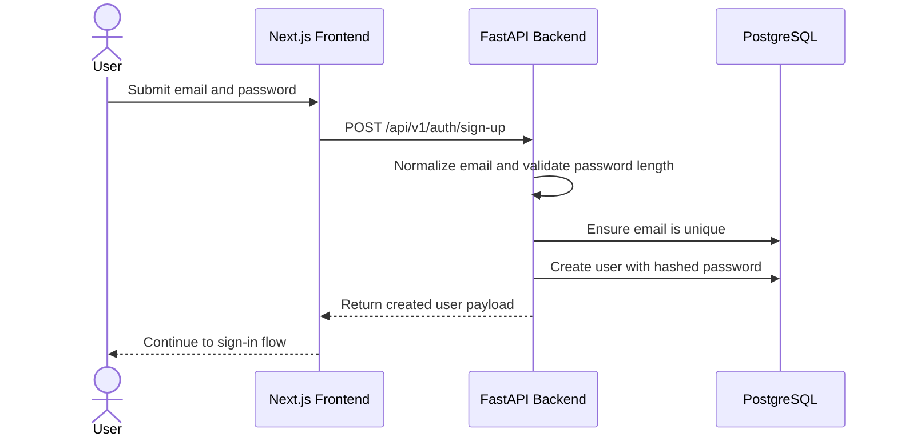

## 2. Sign in flow

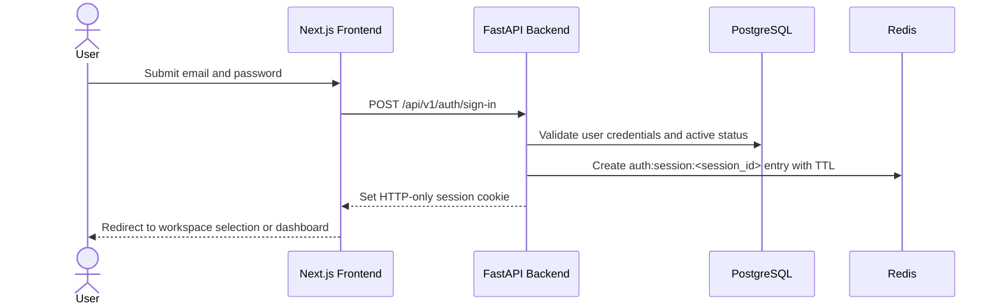

## 3. Session persistence flow

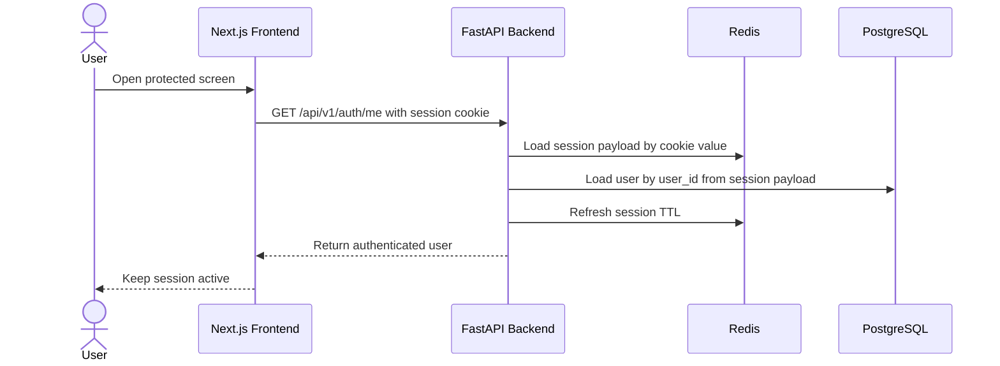

Notes:

- the backend is the auth source of truth; the frontend only forwards the cookie
- if the cookie is missing, the Redis entry is gone, or the user is inactive, `/api/v1/auth/me` returns `401 Not authenticated.`

## 4. Sign out flow

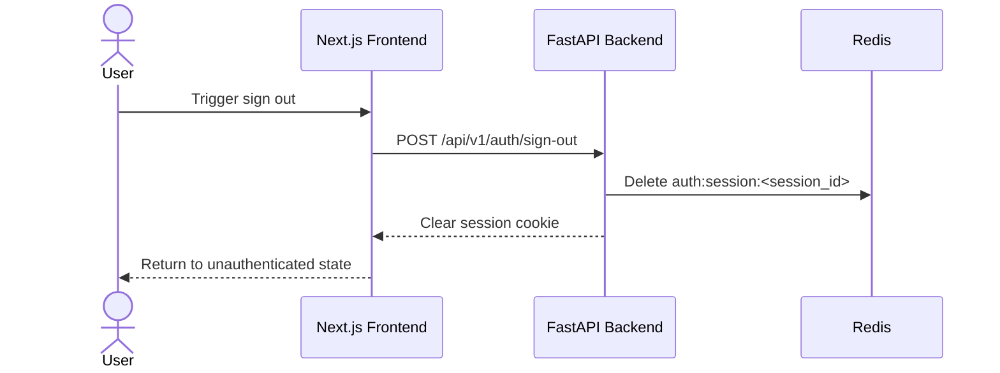

## 5. Password reset flow

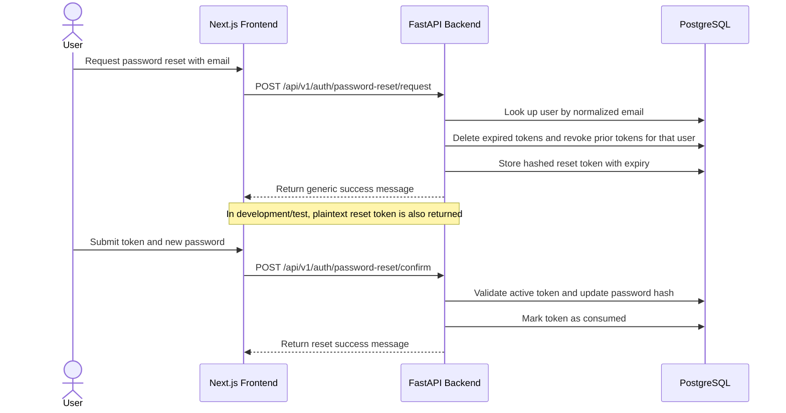

## 6. Workspace onboarding flow

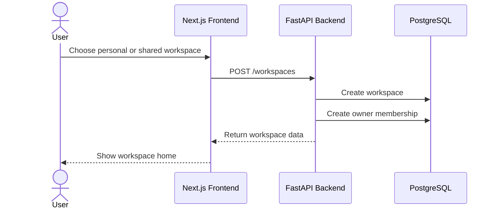

Notes:

- the creator always becomes the `owner` member of the workspace
- both personal and shared workspaces use the same membership model

## 7. Workspace invitation acceptance flow

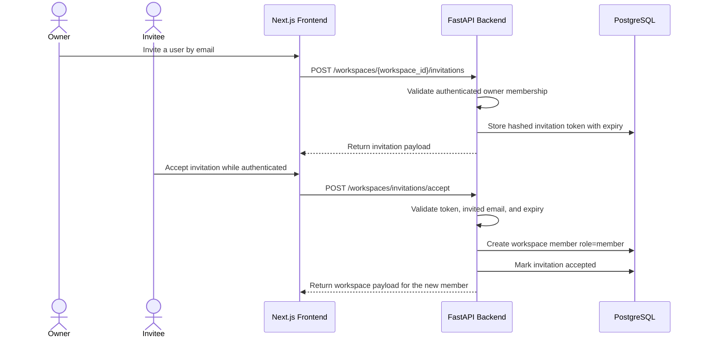

## 8. Transaction creation flow

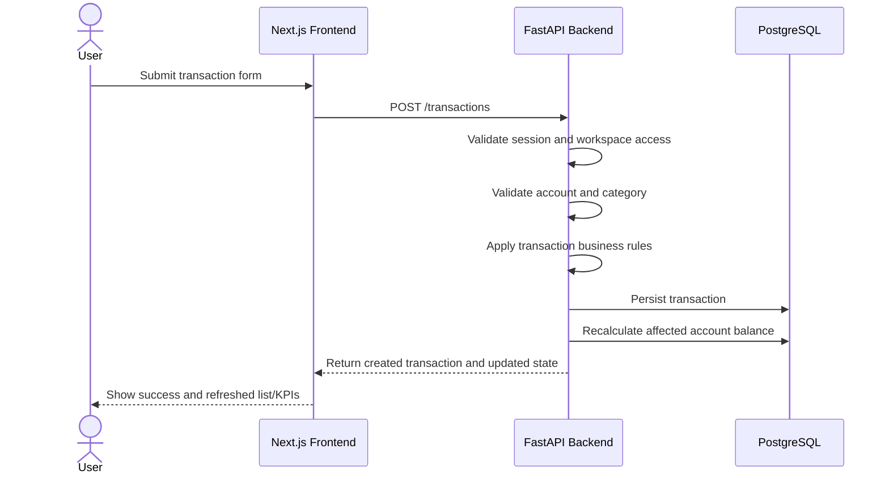

## 9. Shared expense split flow

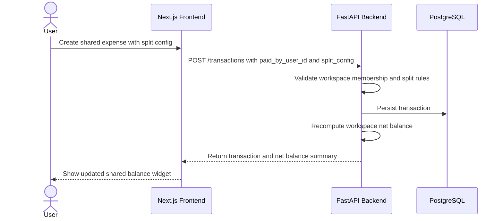

## 10. Settle-up flow

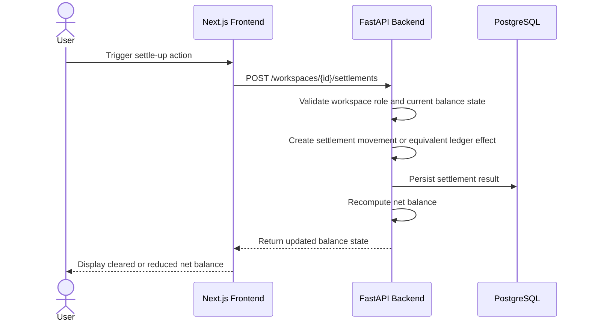

## Flow design notes

### Local container entry flow

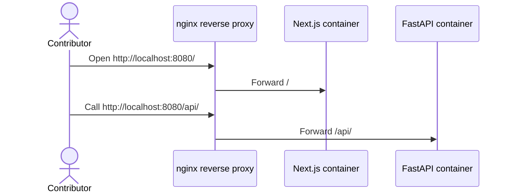

### Authentication

- session behavior is backend-owned and Redis-backed
- the session cookie is HTTP-only, with configurable `secure`, `samesite`, and optional `domain`
- password hashes use PBKDF2-SHA256 plus a configured pepper
- reset tokens are stored hashed in PostgreSQL and have a dedicated TTL

### Financial correctness

- balance updates must happen as part of validated backend workflows
- split calculations must be deterministic and testable
- transfer logic must stay isolated from regular income/expense analytics

### Permissions

- all protected actions must validate workspace membership
- owner/member behavior must be enforced by the backend
- current owner-only actions are workspace settings updates and invitation management

## Future runtime flows to add

As new features are introduced, add sequence or flow diagrams for:

- invitation acceptance
- receipt upload
- scheduled payment generation
- budget status recomputation
- forecast generation
