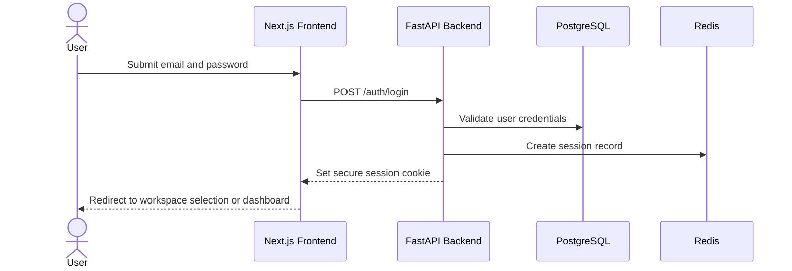
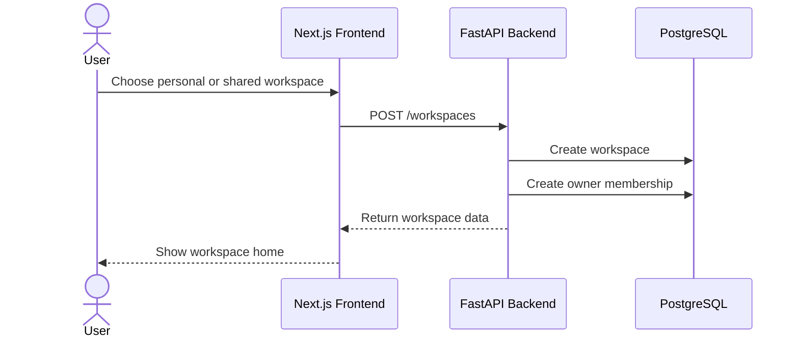
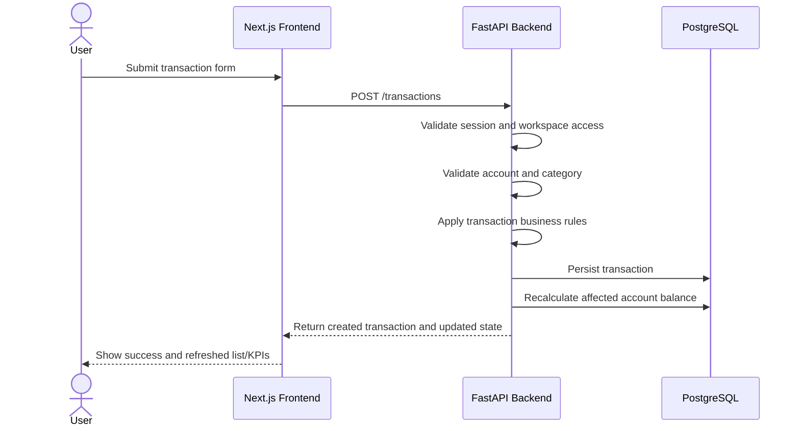
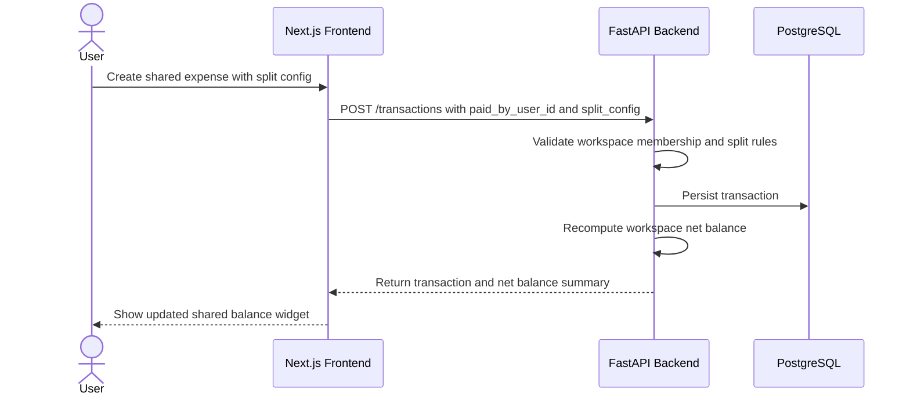
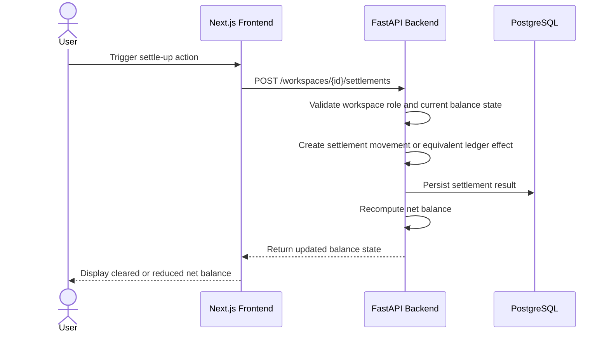

# Runtime Flows

## Purpose

This document captures the key end-to-end flows that define the application's behavior.

At the current planning stage, these flows represent intended behavior and should be refined as implementation progresses.

## 1. Sign in flow

## 2. Workspace onboarding flow

## 3. Transaction creation flow

## 4. Shared expense split flow

## 5. Settle-up flow

## Flow design notes

### Authentication

- session behavior is backend-owned
- the frontend should not be treated as the source of auth truth

### Financial correctness

- balance updates must happen as part of validated backend workflows
- split calculations must be deterministic and testable
- transfer logic must stay isolated from regular income/expense analytics

### Permissions

- all protected actions must validate workspace membership
- owner/member behavior must be enforced by the backend

## Future runtime flows to add

As new features are introduced, add sequence or flow diagrams for:

- invitation acceptance
- password reset
- receipt upload
- scheduled payment generation
- budget status recomputation
- forecast generation
