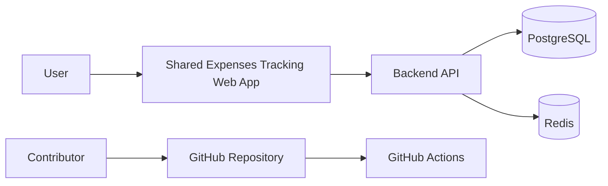
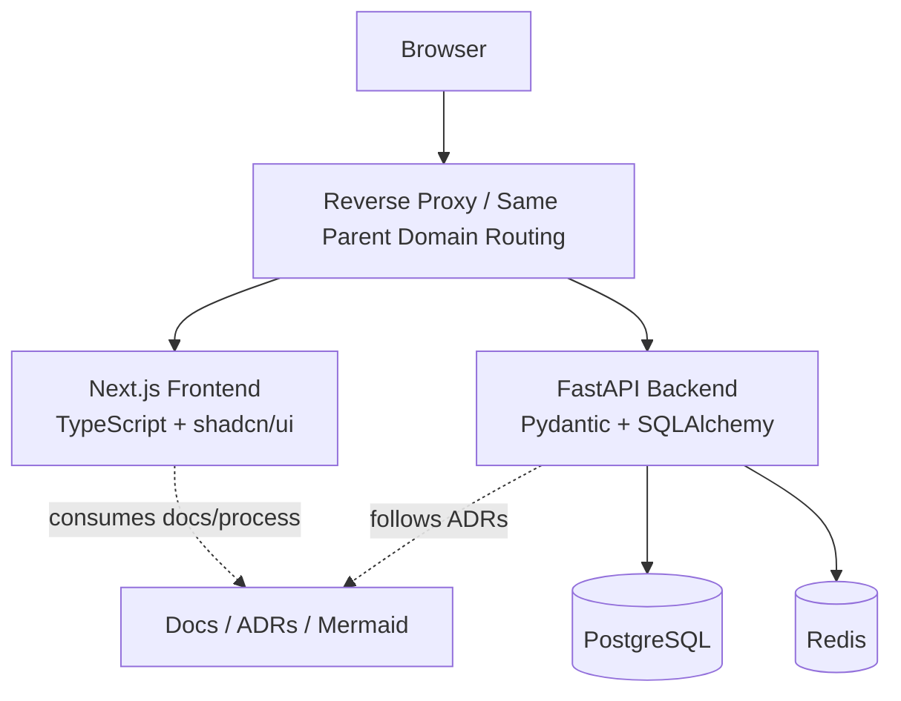

# System Overview

## Overview

The system is planned as a workspace-based finance application composed of a separate frontend and backend within a single repository.

Key properties:

- browser-first web application
- same parent domain deployment model
- reverse-proxied frontend and backend
- backend-owned auth, business logic, and persistence
- workspace-first domain model for both personal and shared use

## Architectural goals

- keep business logic centralized in the backend
- keep UI focused on input, presentation, and user workflows
- make local development and deployment reproducible with Docker Compose
- make architecture decisions explicit through ADRs and Mermaid docs

## C4-style context diagram

## C4-style container diagram

## Container responsibilities

### Frontend

Responsibilities:

- authentication screens and workspace UI
- account, category, and transaction flows
- dashboard presentation
- client-side validation and interaction logic
- API consumption

Non-responsibilities:

- authoritative balance calculation
- permission enforcement
- core financial business rules

### Backend

Responsibilities:

- authentication and session lifecycle
- authorization and workspace access checks
- transaction, account, and split domain logic
- balance recalculation and invariants
- persistence and data access
- API contracts

### PostgreSQL

Responsibilities:

- persistent relational data
- transactional integrity
- schema evolution via Alembic migrations

### Redis

Responsibilities:

- session support
- future short-lived state or caching if needed

## Deployment model

Default deployment assumption:

- same parent domain
- reverse proxy handling frontend/backend routing
- backend session cookies scoped to the deployed domain

This model supports secure cookie-based auth with lower frontend complexity.

## Local bootstrap topology

The root infrastructure baseline standardizes the first local runtime topology through Docker Compose.

Container set:

- `proxy`: nginx reverse proxy exposed to the host
- `frontend`: Next.js application container
- `backend`: FastAPI application container
- `db`: PostgreSQL database
- `redis`: Redis instance

Routing contract:

- requests to `/` go to the frontend container
- requests to `/api/` go to the backend container
- backend-to-database and backend-to-Redis traffic stays on the internal Docker network

This topology mirrors the same-parent-domain deployment assumption and gives the project a stable integration shape before application internals are fully implemented.

## Architecture boundaries

- The frontend should not own financial truth.
- The backend should not render the user interface.
- Money calculations should remain centralized and tested.
- Shared-expense rules should build on the workspace and transaction model, not on a parallel side system.
